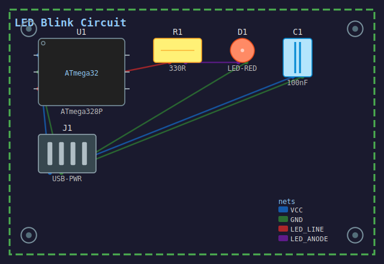
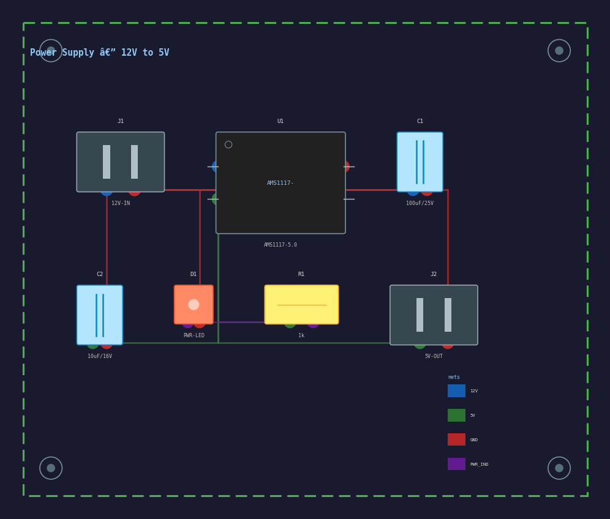
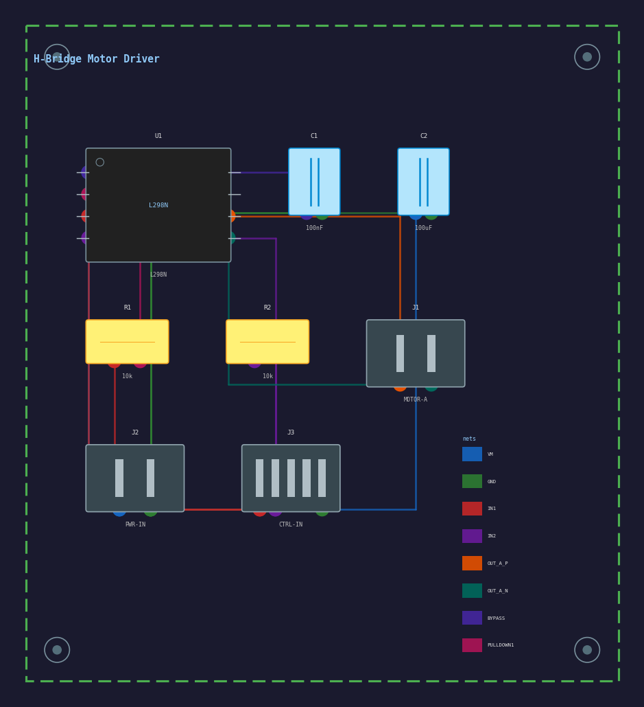

# PCB Schematic to 2D Drawing

A lightweight Python tool that converts a JSON component description into a structured 2D PCB layout drawing (SVG output). Built as part of the UST Automotive Data Science internship evaluation — June 2026.

---

## What I Built

This project implements **Option B**: structured JSON input → 2D board layout drawing.

The tool takes a JSON file describing PCB components (type, value, pin connections) and automatically places them on a virtual board, routes connection traces between nets, and exports a clean SVG drawing showing component placement and connectivity.

I chose Option B over Option A (image parsing) for a deliberate reason: image-based component detection requires a trained vision model and labeled schematic data, which is well outside a 5-day scope. Option B lets me focus on the core pipeline — parsing, placement, rendering — and produce a result that actually works end-to-end. A smaller, complete implementation is more useful than a broad, broken one.


---

## Assumptions

- **Single-layer board only.** All components and traces are rendered on one layer. Multi-layer representation is out of scope.
- **Grid-based placement.** Components are placed on a simple grid. No advanced auto-routing algorithm is used — traces are routed as straight lines between component pins, with basic collision avoidance.
- **5 component types supported:** resistor, capacitor, IC (integrated circuit), LED, and connector. Other types are ignored with a warning.
- **Net connections are pin-to-pin.** Each net in the JSON lists which component pins are connected. The drawing renders a trace between each connected pin pair.
- **No EDA tool integration.** This does not use KiCad, FreeRouting, or any EDA software. All rendering is done with Python (matplotlib / svgwrite).
- **Board dimensions default to 80mm × 55mm** (similar to a small Arduino shield). Configurable via `config.json`.

---

## Installation

Requires Python 3.11+.

```bash
git clone https://github.com/ShashankSagriNayak/pcb-schematic-to-2d
cd pcb-schematic-to-2d
pip install -r requirements.txt
```

`requirements.txt` contains:
```
matplotlib>=3.8
svgwrite>=1.4
```

---

## How to Run

### Option 1 — JSON input (fully offline)

```bash
python run.py --input examples/led_blink.json --output output/led_blink.svg
```


### Option 2 — Run all examples at once

```bash
python run.py --all-examples
```

Output SVGs are saved to the `output/` folder. Open any `.svg` file in a browser to view.

---

## JSON Input Format

```json
{
  "board": {
    "width_mm": 80,
    "height_mm": 55,
    "title": "LED Blink Circuit"
  },
  "components": [
    {
      "id": "U1",
      "type": "ic",
      "value": "ATmega328P",
      "pins": ["VCC", "GND", "PB5", "PB4"]
    },
    {
      "id": "R1",
      "type": "resistor",
      "value": "330R",
      "pins": ["A", "B"]
    },
    {
      "id": "D1",
      "type": "led",
      "value": "RED",
      "pins": ["anode", "cathode"]
    }
  ],
  "nets": [
    { "name": "LED_LINE", "connections": [["U1", "PB5"], ["R1", "A"]] },
    { "name": "LED_CATHODE", "connections": [["R1", "B"], ["D1", "anode"]] },
    { "name": "GND", "connections": [["U1", "GND"], ["D1", "cathode"]] }
  ]
}
```

---

## Example Runs

Three examples are included in the `examples/` folder:

### 1. LED Blink Circuit (`led_blink.json`)
A microcontroller driving an LED through a current-limiting resistor. Tests basic IC + resistor + LED connectivity.

**Input:** ATmega328P + 330Ω resistor + red LED, 3 nets  
**Output:** `output/led_blink.svg`



---

### 2. Power Supply Section (`power_supply.json`)
A 12V to 5V regulator circuit with input/output decoupling capacitors and a power connector.

**Input:** AMS1117-5.0 regulator + 2× capacitors + 1× connector, 4 nets  
**Output:** `output/power_supply.svg`



---

### 3. Motor Driver (`motor_driver.json`)
An H-bridge motor driver with 4 switching transistors, a motor connector, and bypass capacitors.

**Input:** 4× resistors + 2× capacitors + 2× connectors + 1 IC, 8 nets  
**Output:** `output/motor_driver.svg`



---

## Project Structure

```
pcb-schematic-to-2d/
│
├── run.py                  # entry point — single command to run everything
├── requirements.txt
├── config.json             # default board size, colors, grid spacing
│
├── src/
│   ├── parser.py           # JSON → internal component/net model
│   ├── placer.py           # grid-based component placement algorithm
│   ├── router.py           # trace routing between net connections
│   ├── renderer.py         # SVG output generation (svgwrite)
│   
│
├── examples/
│   ├── led_blink.json
│   ├── power_supply.json
│   └── motor_driver.json
│
└── output/                 # generated SVGs go here
```

Every function in `src/` has full type hints on all arguments and return values, per the project requirements.

---

## Architecture

```

JSON component file
        ↓  [parser.py]
Internal model: List[Component], List[Net]
        ↓  [placer.py]
Component positions on board grid
        ↓  [router.py]
Trace paths between pin pairs
        ↓  [renderer.py]
SVG output file
```


---

## What Works

- JSON parsing with validation and clear error messages for unknown component types
- Grid-based placement that respects board boundaries and avoids component overlap
- Trace routing between all nets, rendered as colored lines with net labels
- SVG output with board outline, component symbols, reference designators, values, and net traces
- All 5 component types rendered with recognizable 2D symbols (not just boxes)
- 3 working example circuits with correct output

---

## Known Limitations

- **Trace routing is naive.** Traces are drawn as direct lines between pins. On dense boards, traces will visually cross each other. A real PCB router (like FreeRouting) uses constraint-based algorithms to avoid this — that's beyond this scope.
- **No design rule checking (DRC).** The tool does not validate minimum trace widths, clearances, or pad sizes. These are critical in real PCB design but require EDA-grade tooling.
- **Placement is grid-based, not optimized.** Components are placed in reading order on a grid. A real placer minimizes wire length using heuristics or simulated annealing. The current approach can produce longer traces than necessary.
- **Single layer only.** Real PCBs use 2–16 layers to route complex designs. This tool renders everything on one layer, which would be unroutable for a board with more than ~15 nets.
- **No image input (Option A not implemented).** Converting a schematic image to a component list requires a trained object detection model and labeled training data. This is a meaningful ML project on its own and was intentionally excluded to keep the scope realistic.

---

## What I Would Improve With More Time

1. **Smarter routing** — implement a basic Lee algorithm (maze routing) to avoid trace crossings on denser boards.
2. **Option A image input** — use a vision model (Claude's vision API or a fine-tuned YOLO) to detect component symbols in schematic images, enabling the full image → 2D drawing pipeline.For Option A, the approach would be to fine-tune YOLOv8 on a labeled schematic dataset (e.g. RoboFlow's circuit symbol dataset) to detect component bounding boxes offline, then feed detected component types and positions directly into the existing parser pipeline — replacing the JSON input entirely. The core placer, router and renderer would require zero changes.
3. **More component types** — transistors, inductors, voltage regulators, crystals.
4. **Interactive HTML output** — hover over a net to highlight all connected traces and pins, making the drawing more useful for review.
5. **Placement optimization** — use simulated annealing to minimize total wire length before routing.

---

## Dependencies and Licenses

| Library | Version | License | Used for |
|---|---|---|---|
| matplotlib | ≥3.8 | PSF/BSD | rendering component symbols |
| svgwrite | ≥1.4 | MIT | SVG file generation |


---

## Author

Submitted for UST Automotive Data Science Internship — June 2026  
Problem 3: PCB Schematic to 2D Drawing
